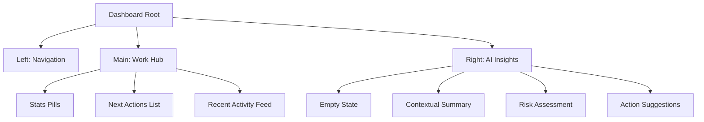
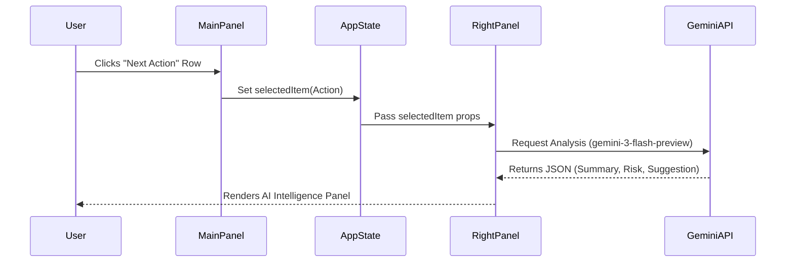

# Sun AI Agency — Technical Overview

This document provides a comprehensive overview of the Sun AI Agency operations platform, detailing its architecture, tech stack, and workflows.

## 🏗 Directory Structure

```text
.
├── components/
│   ├── LeftPanel.tsx       # Navigation & Context (Static)
│   ├── MainPanel.tsx       # Decision Hub (Next Actions, Stats, Activity)
│   └── RightPanel.tsx      # AI Intelligence (Contextual Insights)
├── services/
│   └── geminiService.ts    # Google Gemini API Integration
├── docs/
│   └── 01-overview.md      # Project Documentation (This file)
├── App.tsx                 # Root Layout & State Orchestration
├── constants.ts            # Mock Data & Configuration
├── index.html              # HTML Entry & Asset Loading
├── index.tsx               # React Application Mount
├── metadata.json           # Application Manifest
├── types.ts                # TypeScript Definitions
└── package.json            # Dependencies (Conceptual via ESM)
```

## 🛠 Tech Stack

### Frameworks & Core
- **React 19.0.0**: UI library used via ESM imports.
- **TypeScript**: Typed JavaScript for robust development.
- **Google GenAI SDK**: `@google/genai` for Gemini 3 Flash model interaction.

### UI & Styling
- **Tailwind CSS**: Utility-first CSS framework for rapid UI development.
- **Inter**: Primary sans-serif font for UI and utility.
- **Playfair Display**: Serif font used for editorial flair and headers.
- **Lucide/Emoji**: Minimalist iconography.

### Infrastructure
- **ESM.sh**: Dynamic module loading for browser-native execution.
- **Browser APIs**: Fetch, LocalStorage, CSS Transitions.

## 🗺 Sitemap & Routing

Currently, the application operates as a **Single Page Application (SPA)** with a state-driven dashboard layout.



## 🔄 Core Workflows

### 1. Contextual AI Analysis
The primary innovation is the "Quiet AI" pattern. AI only activates when a human initiates a focus action.



### 2. Decision Support
- **Human Decision:** Reviewing tasks in the Main Panel.
- **AI Clarity:** The Right Panel provides data-driven reasoning to support the decision without auto-executing.

## 🔗 Data & Import Paths

- **Components:** Imported relatively into `App.tsx`.
- **Services:** `geminiService.ts` abstracts the `@google/genai` complexity.
- **Constants:** Centralized mock data in `constants.ts` to simulate a backend.
- **Types:** Single source of truth in `types.ts` for cross-component consistency.

## 🎨 Design Philosophy
- **Editorial Minimalism:** High whitespace, subtle borders, and mixed typography (Serif/Sans).
- **3-Panel Hierarchy:** Fixed left-to-right flow of information density.
- **Calm UI:** No aggressive animations or persistent AI "chatbots". Insights are integrated into the workflow.

## 🚀 Key Features
- **Stat Pills:** Compact, high-level metrics.
- **Flat List Actions:** Prioritizes rows over cards to reduce cognitive load.
- **Risk Alerts:** Specific UI feedback for blockers identified by AI.
- **Context Strip:** Floating UI element that provides deep-dive metadata for the active focus.
