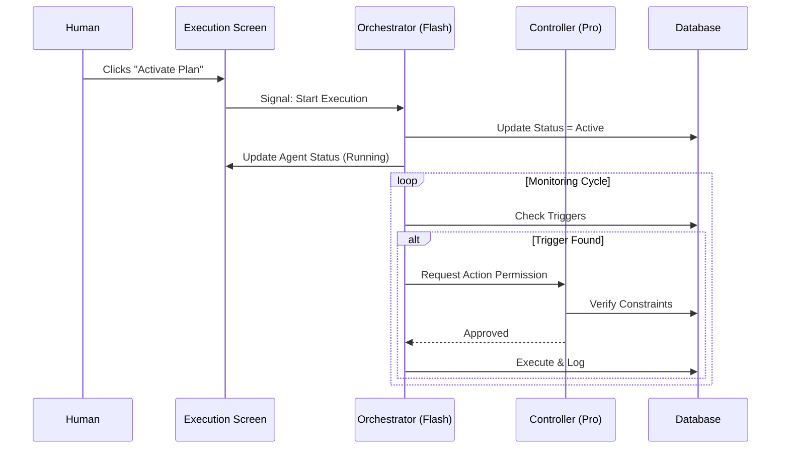
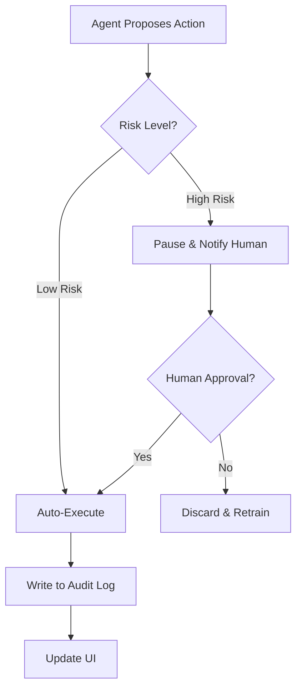

# 🚀 Execution Plan Screen — Architecture & Logic

**Route:** `/projects/:projectId/execution-plan`
**Role:** The Operational "Flight Deck"
**Mental Model:** Blueprint (Truth) → Intelligence (Options) → **Execution Plan (Commitment)**

---

## 1. Gemini 3 Feature & Agent Matrix

This table defines exactly how **Gemini 3** features power the specialized agents within the Execution Plan.

| Agent Role | Model Selection | Gemini Feature | Logic & Usage |
| :--- | :--- | :--- | :--- |
| **Orchestrator** | `gemini-3-flash-preview` | **Function Calling** | Routes user clicks (e.g., "Start Workflow") to specific backend services or other agents. Fast decision routing. |
| **Planner** | `gemini-3-pro-preview` | **Thinking Config** | Re-calculates timelines when dependencies shift. Uses deep reasoning (4k budget) to predict cascading delays. |
| **Analyst** | `gemini-3-pro-preview` | **Code Execution** | Python-based validation of budgets, resource burn rates, and scheduling logic to ensure 100% mathematical accuracy. |
| **Researcher** | `gemini-3-pro-preview` | **Google Search & Maps** | Grounding. Verifies vendor availability, external API up-time, or local event logistics during execution. |
| **Content** | `gemini-3-flash-preview` | **Text Generation** | Generates status emails, Slack updates, and brief revisions. Low latency is priority. |
| **Creative** | `gemini-2.5-flash-image` | **Image Generation** | Creates visual artifacts (banners, ad mockups) required by task tickets. |
| **Retriever** | `gemini-3-flash-preview` | **RAG / Interactions** | Recalls context from previous steps (Blueprint, Intelligence) to ensure consistency. |
| **Controller** | `gemini-3-pro-preview` | **Structured Outputs** | The "Safety Gate". Validates all agent outputs against the Blueprint schema before writing to DB. |

---

## 2. Screen Layout & Wireframes

### Global Layout (3-Panel)
*   **Left (Nav):** Standard Context.
*   **Center (Execution):** The active workspace.
*   **Right (Control):** The "Controller Gate" and status summary.

### Center Panel: The Execution Tabs

#### Tab 1: Tasks (Kanban/List)
*   **Visual:** High-density rows.
*   **Columns:** Status, Task Name, Owner (Human/Agent), Due Date.
*   **AI Interaction:** Agents auto-move cards. "Planner" injects new sub-tasks if blocked.

#### Tab 2: Agents (Active Roster)
*   **Visual:** Grid of "Agent Cards".
*   **Card Content:**
    *   **Header:** Agent Name & Icon.
    *   **Status:** Idle (Gray), Thinking (Pulsing Blue), Executing (Green).
    *   **Current Action:** "Drafting email...", "Analyzing dependencies...".
    *   **Logs:** Expandable terminal view of reasoning traces.

#### Tab 3: Automations (Triggers)
*   **Visual:** "If This Then That" style rows.
*   **Content:** Trigger Event → Logic → Action.
*   **Toggle:** Enable/Disable switch (Human override).

#### Tab 4: Workflows (Chains)
*   **Visual:** Horizontal dependency chain (SVG).
*   **State:** Green checkmarks for completed steps, pulsating ring for current step.

#### Tab 5: Timeline (Gantt)
*   **Visual:** Read-only view of the Planner's roadmap.
*   **Overlay:** "Actual vs Planned" comparison lines.

---

### Right Panel: The Controller Gate (Sticky)

**1. Execution Status**
*   **Badge:** `ACTIVE`, `PAUSED`, or `COMPLETED`.
*   **Health:** "On Track" (Green) or "Risk Detected" (Amber - triggered by Analyst).

**2. Master Controls**
*   `[ ▶ Activate Plan ]` - Starts the Orchestrator.
*   `[ ⏸ Pause All ]` - Halts all Agent triggers immediately.
*   `[ ↺ Rollback ]` - Reverts to previous plan version.

**3. Live Audit Log**
*   Scrolling feed of *approved* actions.
*   Format: `[Timestamp] [Agent] -> [Action]`.

---

## 3. Data Model (`ExecutionPlan`)

```typescript
interface ExecutionPlan {
  id: string;
  projectId: string;
  version: number;
  status: 'draft' | 'active' | 'paused' | 'completed';
  
  // The Workforce
  activeAgents: {
    id: string; // 'planner', 'researcher'
    status: 'idle' | 'working' | 'error';
    currentTask?: string;
  }[];

  // The Logic
  automations: {
    id: string;
    trigger: string; // 'on_task_complete'
    action: string;  // 'send_email'
    enabled: boolean;
  }[];

  // The Work
  tasks: ActionItem[]; // From types.ts
  
  // The History
  auditLog: {
    timestamp: string;
    actor: string; // 'Human' or 'AgentName'
    action: string;
    outcome: string;
  }[];
}
```

---

## 4. Mermaid Diagrams

### Workflow: Activation Logic


### Logic: The "Controller Gate" Pattern


---

## 5. Implementation Prompts (Step-by-Step)

### Phase 1: UI Skeleton
> "Build the `ExecutionPlanPanel.tsx` component. Use the standard 3-panel layout.
> **Center:** Implement a tab system (Tasks, Agents, Automations).
> **Right:** Create a sticky 'Controller' panel with a big 'Activate' button and an empty Audit Log list.
> **State:** Use a mock `ExecutionPlan` object."

### Phase 2: Agent Roster UI
> "In the 'Agents' tab, render a grid of Agent Cards.
> Each card needs a visual status indicator (Pulse for working).
> Map the `activeAgents` state to these cards.
> Add a 'View Logs' button that expands a small terminal window inside the card."

### Phase 3: The Orchestrator Hook
> "Create `hooks/useExecution.ts`.
> Implement a `toggleExecution()` function that switches the plan status.
> When Active, use `setInterval` to simulate an 'Orchestrator Heartbeat' that picks a random task and marks it 'In Progress' every 5 seconds to demonstrate the UI."

### Phase 4: Gemini Integration
> "Connect the `Orchestrator` to Gemini 3 Flash.
> When a user clicks 'Resolve Blocker' on a task, send the task context to the model.
> Use `FunctionCalling` to determine if it should call the `Planner` (for rescheduling) or `Researcher` (for info)."

---

**Next Step:** Begin Phase 1 (UI Skeleton).
