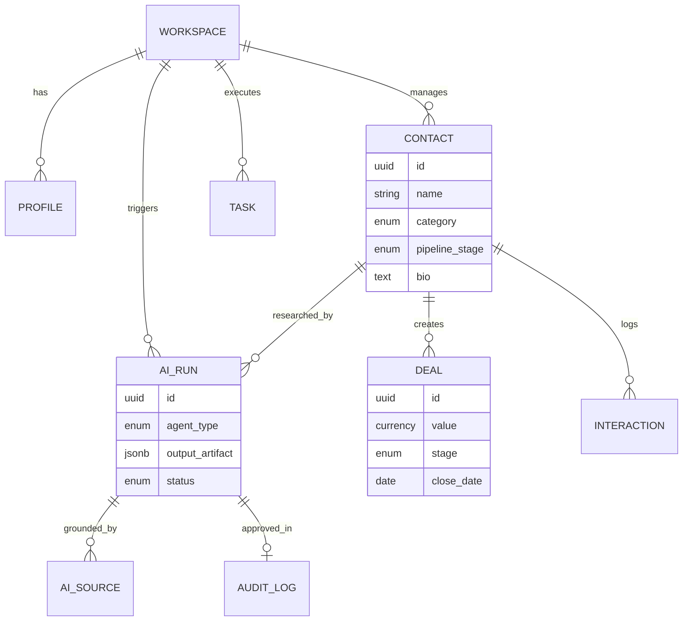
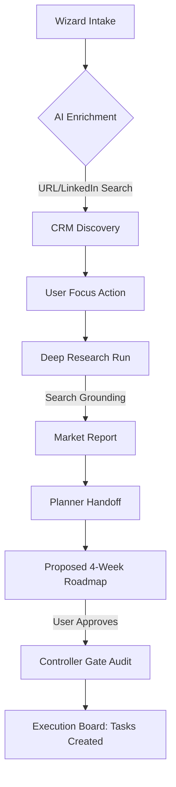
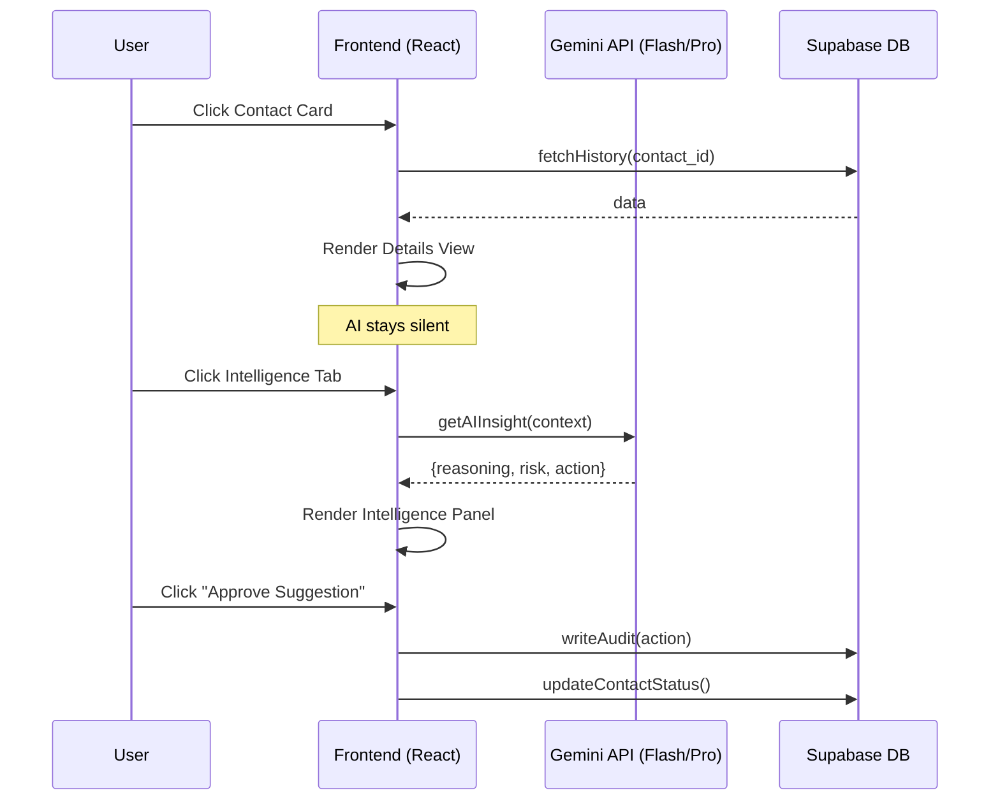
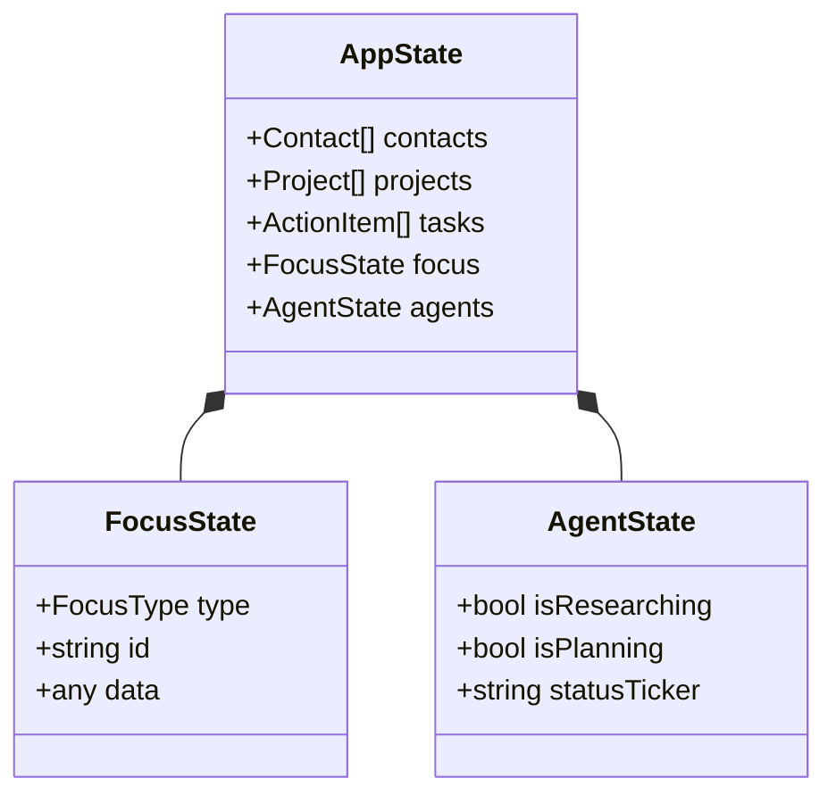

# Sun AI Agency — System Diagrams

## 1. Entity-Relationship Diagram (ERD)
Visualizes the structural relationships in the Supabase schema.

## 2. Lead-to-Execution Workflow (Flowchart)
The path an agency lead takes from initial capture to automated tasking.

## 3. "Quiet AI" Sequence Diagram
How intelligence is delivered without cluttering the UI.

## 4. Class Diagram: Frontend State Model
How the TypeScript types map to the React application state.

---
**Documentation Level**: Production Grade.
**Workflow Logic**: Verified.