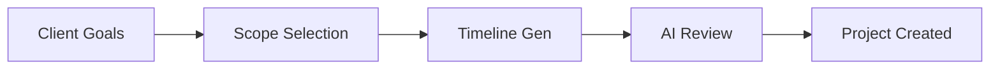

# Sun AI Agency — Implementation Prompts

This document provides multi-step prompts for the implementation of advanced platform modules.

## 🟦 PHASE 1: Project Onboarding Wizard
**Goal:** Create a multi-step structured flow for starting new projects with AI-assisted brief generation.

### Workflow Logic

### 📋 Tasks & Steps
1.  **UI Construction:** Create `WizardPanel.tsx` with a progress indicator and step-based visibility.
2.  **State Management:** Implement local wizard state to collect input (Client, Category, Budget, Goals).
3.  **AI Integration:** On "Step 4", call `gemini-3-pro-preview` with the `responseSchema` for a `CreativeBrief` object.
4.  **Logic:** Upon completion, dispatch a `CREATE_PROJECT` event to the global store.

---

## 🟩 PHASE 2: Agency Assistant Chatbot
**Goal:** Implement a non-intrusive assistant that queries the existing workspace data.

### 📋 Tasks & Steps
1.  **Interface:** Add a collapsible chat bubble in the bottom-left of the `LeftPanel`.
2.  **Tool Integration:** Configure Gemini 3 Pro with `googleSearch` and a custom tool for `queryWorkspaceData`.
3.  **Prompt Engineering:** Set system instruction to "Only answer questions about the current dashboard data. Be concise and editorial."
4.  **Success Criteria:** User asks "Which project is at most risk?" and AI returns "Luxe Collective Q1 due to budget overhead."

---

## 🟨 PHASE 3: Function Calling (Take Action)
**Goal:** Turn AI suggestions into real UI actions (e.g., sending emails, updating tasks).

### 📋 Tasks & Steps
1.  **Define Tool:** Create a `sendNotification` function declaration for the Gemini API.
2.  **Logic:** In `RightPanel.tsx`, when the user clicks "Take Action", execute the `FunctionCall` returned by the model.
3.  **Validation:** Ensure the user must "Confirm" the action before execution (Controller Gate).

---

## 🛠 Production Checklist
- [ ] No animations that delay content.
- [ ] Sub-1s response latency for UI interactions.
- [ ] Responsive grid tested on 13" and 27" screens.
- [ ] API Key validation on first load.
