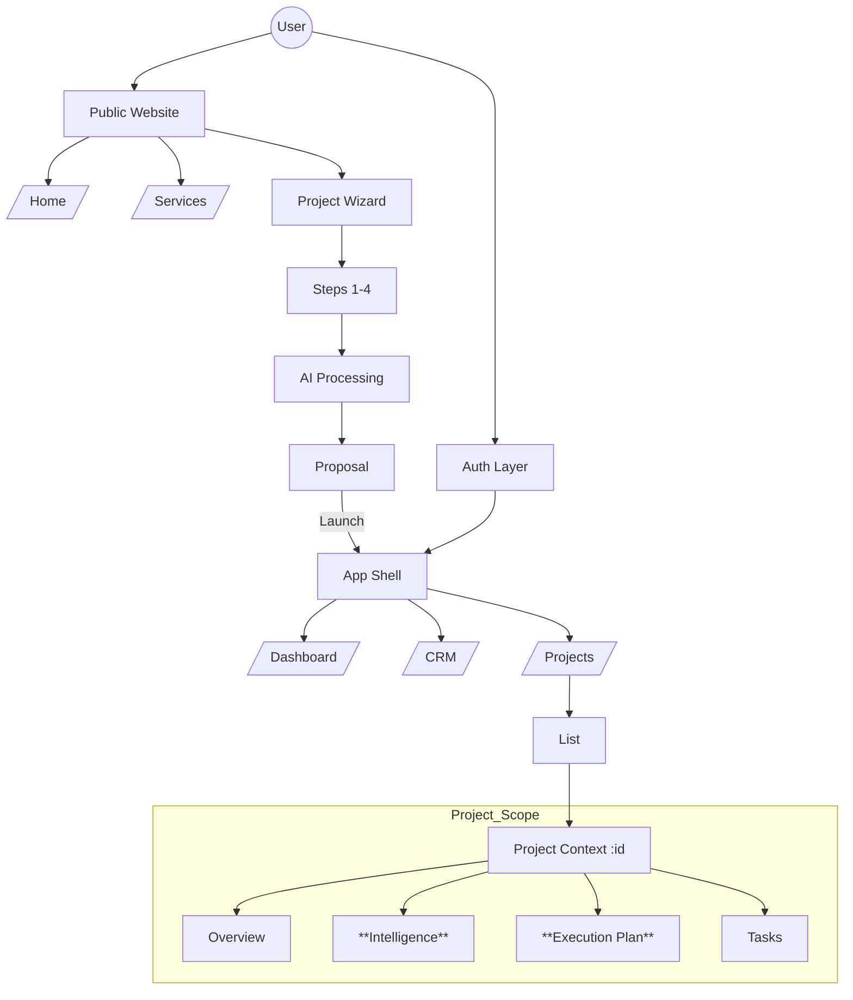
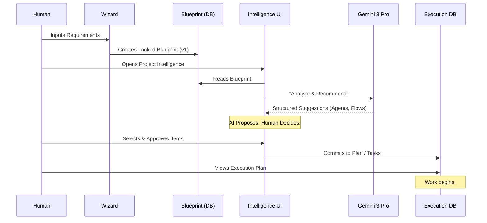

# 🗺️ Sun AI Agency — Sitemap & Routing Architecture

**Role:** Principal Product Architect
**Version:** 2.0 (Intelligence & Execution Integration)
**Status:** Approved for Production

---

## 1. UPDATED SITEMAP (TREE)

```text
Root (/)
├── Public Website
│   ├── Home (/)
│   ├── Services (/services)
│   ├── AI Agents (/agents)
│   ├── Work / Case Studies (/work)
│   ├── About (/about)
│   └── Legal (/privacy, /terms)
│
├── Auth
│   ├── Login (/login)
│   └── Sign Up (/signup)
│
├── Project Wizard (Intake)
│   ├── Start (/wizard/start)
│   ├── Identity (/wizard/identity)
│   ├── Scope (/wizard/scope)
│   ├── Constraints (/wizard/constraints)
│   ├── Review (/wizard/review)
│   ├── AI Processing (/wizard/processing)
│   └── Proposal (/wizard/proposal)
│
└── Agency Dashboard (/app)
    ├── Overview (/app/main)
    ├── CRM (/app/crm)
    │   └── Contact Details (/app/crm/:contactId)
    ├── Tasks (/app/tasks)
    ├── Settings (/app/settings)
    │
    └── Projects (/app/projects)
        └── Project Scope (/app/projects/:projectId)
            ├── Overview (Default)
            ├── Intelligence (The Brain)
            ├── Plan (The Roadmap)
            └── Tasks (The Execution)
```

---

## 2. ROUTING TABLE

| Area | Route | Auth Required | Purpose |
| :--- | :--- | :---: | :--- |
| **Public** | `/` | No | Marketing conversion & brand establishment. |
| **Public** | `/agents` | No | Showcase of AI capabilities and architecture. |
| **Auth** | `/login` | No | User authentication entry point. |
| **Wizard** | `/wizard/*` | No | Multi-step state machine for project intake. |
| **Dashboard** | `/app/main` | **Yes** | High-level operational metrics & daily focus. |
| **CRM** | `/app/crm` | **Yes** | Client relationship & deal pipeline management. |
| **Portfolio** | `/app/projects` | **Yes** | List view of all active engagements. |
| **Project** | `/app/projects/:id` | **Yes** | Single project dashboard (Stats, Health). |
| **Intelligence**| `/app/projects/:id/intel` | **Yes** | **AI Analysis Screen.** Interprets Blueprint. |
| **Execution** | `/app/projects/:id/plan` | **Yes** | **Execution Plan.** Approved roadmap view. |
| **Tasks** | `/app/projects/:id/tasks` | **Yes** | Granular ticket/kanban management. |

---

## 3. WIZARD ROUTING LOGIC

The Wizard is a linear state machine.

**Routes:**
*   **Entry:** `/wizard/start` (Resets state)
*   **Steps:** `/wizard/:stepId` (Identity, Scope, Constraints)
*   **Gate:** `/wizard/review` (Human Controller Approval)
*   **Processing:** `/wizard/processing` (AI Generation - Locked UI)
*   **Exit:** `/wizard/proposal` (Final Output)

**Logic:**
*   **Persistence:** State is saved to `localStorage` on every keystroke.
*   **Guards:** Users cannot access `/processing` without passing `/review`.
*   **Completion:** Clicking "Launch" on Proposal creates a DB record and redirects to `/app/projects/:newId`.

---

## 4. DASHBOARD & PROJECT ROUTING

The Project module uses nested routing for deep focus.

**Pattern:** `/app/projects/:projectId/:view`

1.  **Overview** (`/`)
    *   High-level health, burn rate, team status.
2.  **Intelligence** (`/intel`)
    *   **Read-Only Input:** Consumes the locked Blueprint.
    *   **AI Output:** Agents, Automations, Journeys.
    *   **Action:** "Add to Plan" (Commits to DB).
3.  **Plan** (`/plan`)
    *   Visual Gantt/Timeline of *approved* milestones.
    *   Resource allocation view.
4.  **Tasks** (`/tasks`)
    *   The atomic unit of work (Kanban/List).
    *   Where "Execution" actually happens.

---

## 5. USER JOURNEY TABLE

| Journey | Actor | Screens (Order) | Outcome |
| :--- | :--- | :--- | :--- |
| **Inbound Lead** | Client | `Home` → `Wizard` → `Proposal` | A structured **Blueprint** is created. |
| **Project Setup** | Admin | `Proposal` → `Confirm` → `Dashboard` | Project instantiated in DB. |
| **Intelligence** | Strategist | `Project` → `Intelligence` → `Approve` | AI Agents/Workflows are selected. |
| **Execution** | PM | `Intelligence` → `Plan` → `Tasks` | Work is assigned to humans/agents. |
| **Daily Ops** | Employee | `Dashboard` → `Tasks` | Tasks are marked complete. |

---

## 6. MERMAID DIAGRAM — SITEMAP



---

## 7. MERMAID DIAGRAM — CORE FLOW

**The "Quiet AI" Protocol: Blueprint to Execution**


