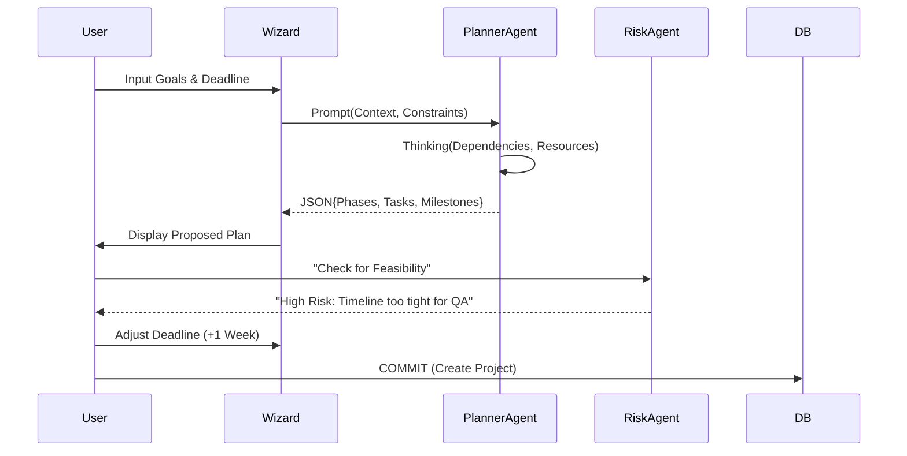

# Sun AI Agency — Project Management Module Architecture

**Version:** 1.0 (Draft)
**Theme:** "Quiet Execution"
**Goal:** Transform project management from administrative overhead into an AI-orchestrated flow of high-value decisions.

---

## 📊 Feature & Progress Tracker

| Sequence | Feature / Component | Type | Complexity | Status |
| :--- | :--- | :---: | :---: | :---: |
| **PM-01** | **Project Dashboard (Portfolio View)** | UI/Core | Medium | 🔴 |
| **PM-02** | **Task Kanban Board** | UI/Core | High | 🔴 |
| **PM-03** | **Project Detail Drawer (Right Panel)** | UI/Core | Low | 🔴 |
| **PM-04** | **Planner Agent (WBS Generator)** | AI/Logic | High | 🔴 |
| **PM-05** | **Risk Analyst Agent (Thinking)** | AI/Logic | High | 🔴 |
| **PM-06** | **Resource Timeline (Gantt)** | UI/Adv | High | 🔴 |
| **PM-07** | **Auto-Status Reporter** | AI/Gen | Medium | 🔴 |
| **PM-08** | **Budget Burn Calculator (Python)** | AI/Code | Medium | 🔴 |
| **PM-09** | **Brief Extractor (PDF/Doc)** | AI/RAG | High | 🔴 |
| **PM-10** | **Controller Gate (Approval Log)** | Logic | Medium | 🔴 |

*(Legend: 🟢 Complete, 🟡 In Progress, 🔴 Pending)*

---

## 🤖 Gemini 3 Capability Matrix (PM Specific)

| Agent / Feature | Model | Tool/Config | Use Case |
| :--- | :--- | :--- | :--- |
| **Planner Agent** | Gemini 3 Pro | `thinkingConfig` (4k) | Breaking a generic "Website Build" brief into 40 specific tasks with dependencies. |
| **Risk Analyst** | Gemini 3 Pro | `codeExecution` | Calculating schedule variance and burn rates using Python for exact math. |
| **Market Grounding**| Gemini 3 Pro | `googleSearch` | verifying 3rd party vendor pricing or tech stack viability during planning. |
| **Status Reporter** | Gemini 3 Flash | `structuredOutput` | Summarizing 50+ chat logs and task updates into a clean JSON status report. |
| **Resource Optimizer**| Gemini 3 Pro | `thinkingConfig` | Identifying that "Designer A" is double-booked across two different projects. |

---

## 📐 3-Panel Layout Logic (PM Context)

### Panel A: Navigation (Context)
*   **Active Route:** `Projects` or `Tasks`.
*   **Filters:** "My Tasks", "At Risk Projects", "High Value", "Design Team".
*   **Quick Actions:** "+ New Project", "+ Quick Task".

### Panel B: Work Surface (Execution)
*   **View 1: Portfolio Grid:** High-level cards of all active engagements with "Traffic Light" health indicators.
*   **View 2: Kanban Board:** Drag-and-drop tasks (Backlog -> Doing -> Review -> Done).
*   **View 3: Timeline:** SVG/Canvas Gantt chart showing dependencies.

### Panel C: Intelligence (Insight)
*   **Tab 1: Details:** Static metadata (Team, Budget, Files).
*   **Tab 2: Intelligence:**
    *   *Risk Score:* 0-100 (Calculated by Analyst).
    *   *Bottlenecks:* "Waiting on Client Approval since Tuesday."
    *   *Suggestions:* "Move deadline or add resource."
*   **Tab 3: Drafts:** AI-generated Briefs or Status Reports waiting for approval.

---

## 🔄 Workflows & User Journeys

### Journey 1: The "Kickoff" (Planner Agent)
1.  **User** clicks "New Project" -> Opens Wizard.
2.  **User** inputs: "E-commerce launch for Maison Laurent. Deadline Nov 1."
3.  **Planner Agent** (Gemini 3 Pro) activates.
    *   *Thinking:* "E-com requires Design, Frontend, Backend, QA..."
4.  **UI** displays "Proposed Project Plan" in Panel C (Right).
    *   *List:* 4 Phases, 12 Milestones, 24 Tasks.
5.  **User** reviews, edits two dates, and clicks **"Approve Plan"**.
6.  **System** batch-creates records in Supabase/State.

### Journey 2: The "Firefight" (Risk Agent)
1.  **System** logs a task moved to "Blocked".
2.  **Risk Analyst** runs in background.
    *   *Logic:* Blocked task is on the Critical Path.
3.  **UI** updates Project Health from "Green" to "Amber".
4.  **User** sees Amber dot, clicks Project.
5.  **Panel C** shows: "Risk: Critical Path blocked. Projected delay: 4 days."
6.  **Agent** suggests: "Email Vendor" or "Swap Resource".

### Journey 3: The "Reporter" (Status Auto-Gen)
1.  **User** views Client Dashboard.
2.  **User** clicks "Generate Weekly Report".
3.  **Agent** (Flash) reads all completed tasks + chat logs from the week.
4.  **Agent** generates a 3-bullet executive summary.
5.  **User** edits tone, then clicks **"Send to Client"**.

### Mermaid Diagram: Intelligent Planning Flow

---

## 🛠 Multistep Implementation Prompts

### 🟦 PROMPT 1: Project Dashboard & Data Model
**Goal:** Create the high-level portfolio view and define the Project/Task TypeScript interfaces.

**Tasks & Steps:**
1.  **Update `types.ts`:** Define `Project` (phase, health, team), `Task` (dependencies, effort), and `Milestone`.
2.  **Create `ProjectsPanel.tsx`:** Implement a grid view of `ProjectCard` components.
3.  **Visuals:** Each card needs a "Health Dot" (Green/Amber/Red) and a "Mini Sparkline" of completed tasks.
4.  **Logic:** Clicking a card sets `focus` state to that project (triggering Right Panel).

**Success Criteria:**
- Renders `MOCK_PROJECTS` in a responsive grid.
- Health dots render correctly based on status.
- Clicking updates the global Focus context.

**Production Checklist:**
- [ ] Responsive grid (1 col mobile, 3 col desktop).
- [ ] Text truncation for long descriptions.
- [ ] Accessible ARIA labels on cards.

---

### 🟩 PROMPT 2: The Kanban Board (Execution)
**Goal:** A fully functional drag-and-drop task board within the Main Panel.

**Tasks & Steps:**
1.  **Create `TasksPanel.tsx`:** A horizontal scrolling container with columns (Backlog, In Progress, Review, Done).
2.  **Task Cards:** Minimalist cards showing Title, Assignee (Avatar Stack), and Priority Badge.
3.  **Interaction:** Implement `onDragEnd` logic (simulated or using dnd-kit) to update task status.
4.  **Controller Gate:** Moving a task to "Done" triggers a confetti effect and logs an `AuditLog` entry.

**Success Criteria:**
- Smooth movement between columns.
- Visual feedback on hover/drag.
- State updates persist to `localStorage`.

**Production Checklist:**
- [ ] Horizontal scrollbar hidden but functional.
- [ ] Empty states for columns ("No tasks in review").
- [ ] Optimistic UI updates (update state before backend confirms).

---

### 🟨 PROMPT 3: The Planner Agent (AI WBS)
**Goal:** Generate a structured task list from a simple text description using Gemini 3 Pro.

**Tasks & Steps:**
1.  **Service:** Create `services/ai/plannerAgent.ts`.
2.  **Function:** `generateProjectPlan(brief: string, constraints: any)`.
3.  **Config:** Use `thinkingConfig` (budget 4096) to reason about dependencies.
4.  **Schema:** Enforce `responseSchema` to return `Array<Task>` with `estimatedDays` and `dependencyId`.
5.  **UI:** Add a "Magic Plan" button in the `WizardPanel` that populates the task list.

**Success Criteria:**
- Input: "Launch a coffee brand website."
- Output: "1. Brand Identity, 2. Wireframes, 3. Shopify Setup..."
- Tasks have logical ordering (Design before Code).

**Production Checklist:**
- [ ] Loading state handled (Thinking can take 5-10s).
- [ ] Error handling for malformed JSON.
- [ ] User can delete/edit AI suggestions before committing.

---

### 🟥 PROMPT 4: The Resource Optimizer (Gantt)
**Goal:** Visualize the project timeline and highlight resource conflicts.

**Tasks & Steps:**
1.  **Component:** Create `ResourceTimeline.tsx`.
2.  **Visualization:** Render tasks as horizontal bars on a time axis.
3.  **AI Logic:** `analyzeResourceConflicts(projects)`.
4.  **Visual Feedback:** If "Julian" is assigned two "High Effort" tasks on the same day, draw a red hatch pattern on the bar.
5.  **Right Panel:** Show "Conflict Detected" alert in the Intelligence tab.

**Success Criteria:**
- Scrollable timeline view (Horizontal).
- Visual indicator for overlapping assignments.
- "Resolve" button that auto-shifts one task by +2 days.

**Production Checklist:**
- [ ] Date math utility (using `date-fns` or native `Date`).
- [ ] Performance optimization (windowing) for large task lists.
- [ ] Mobile fallback (List view instead of Gantt).

---

### 🟪 PROMPT 5: The Risk Analyst (Code Execution)
**Goal:** Use Python to calculate precise project metrics (Schedule Variance, CPI).

**Tasks & Steps:**
1.  **Service:** Create `services/ai/analystAgent.ts`.
2.  **Function:** `calculateProjectRisk(projectData)`.
3.  **Tool:** Enable `codeExecution`.
4.  **Prompt:** "Given these tasks, start dates, and % complete, write Python to calculate the Schedule Performance Index (SPI)."
5.  **UI:** Render the SPI value in the Project Header. If `< 0.9`, show "At Risk".

**Success Criteria:**
- Returns a float value (e.g., 0.85).
- UI updates color based on the threshold.
- "Show Math" dropdown displays the Python code used.

**Production Checklist:**
- [ ] Fallback if code execution fails.
- [ ] Cache results to prevent re-running on every render.
- [ ] Explainable tooltip for non-technical users ("SPI < 1 means we are behind schedule").
