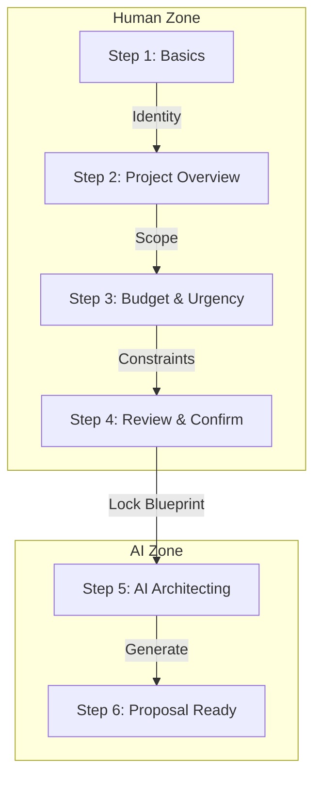

# 🧩 Wizard System — Architecture & Specification

**Status:** Draft Specification
**Role:** Principal Product Architect
**Goal:** Define a deterministic, multi-step intake system that builds a "Live Architecture Blueprint".

---

## 1. System Overview & Logic

The **Wizard** is a guided, multi-step intake and planning system that converts **human intent** into a **structured, persistent system blueprint**.

It is **not a form** and **not a chat**. It is a **State Machine** for decision-making.

### Core Design Principles
1.  **One decision type per screen**: Reduce cognitive load.
2.  **Progressive disclosure**: Hide complexity until relevant.
3.  **Autosave everything**: State is persistent immediately.
4.  **Right Panel = Truth**: Reflects only confirmed inputs, never AI guesses.
5.  **AI is Silent until Step 5**: No hallucination loops during data entry.
6.  **Controller Gate**: Human must click "Confirm" before expensive AI agents run.
7.  **Single Source of Truth**: Every step mutates one `wizard_blueprint` object.

### The Flow


---

## 2. Screen Inventory & Logic Matrix

| Screen | Route | Purpose | AI Agents | Automations | Live Blueprint Update |
| :--- | :--- | :--- | :--- | :--- | :--- |
| **Basics** | `/wizard/step-1` | Capture Identity | Orchestrator (Idle) | Autosave | `basics: { name, company }` |
| **Project Overview** | `/wizard/step-2` | Define What & Why | Retriever (RAG) | Debounce Save | `scope: { type, goals }` |
| **Budget & Urgency** | `/wizard/step-3` | Align Feasibility | Analyst (Silent) | Calc Range | `constraints: { budget, time }` |
| **Review & Confirm** | `/wizard/step-4` | Human Validation | Controller | Lock State | `status: "locked"` |
| **AI Architecting** | `/wizard/step-5` | Execution | **All Agents** | Job Polling | `artifacts: { roadmap, roi }` |
| **Proposal Ready** | `/wizard/step-6` | Present Outcome | Content | PDF Gen | `version: "v1.0"` |

---

## 3. Data Object Model (`wizard_blueprint`)

The Wizard mutates a single JSON object. This object is the "Payload" sent to the AI Swarm in Step 5.

```typescript
interface WizardBlueprint {
  // Step 1: Basics
  id: string;
  basics: {
    contactName: string;
    companyName: string;
    website?: string;
  };
  
  // Step 2: Overview
  appDefinition: {
    type: 'SaaS' | 'Marketplace' | 'Internal Tool' | 'AI Wrapper';
    industry: string;
    description: string;
  };
  goals: string[]; // e.g. ["MVP in 4 weeks", "Scale to 10k users"]
  
  // Step 3: Constraints
  constraints: {
    budgetRange: string;
    timelineUrgency: 'Normal' | 'High' | 'Critical';
    techStackPref?: string[];
  };
  
  // Step 5: AI Outputs (Populated after processing)
  deliverySnapshot?: {
    estimatedWeeks: number;
    estimatedCost: number;
    riskScore: number;
  };
  agentRecommendations?: AgentConfig[];
  
  // Meta
  status: 'draft' | 'processing' | 'complete';
  versions: ProposalVersion[];
}
```

---

## 4. Step-by-Step Specification

### 1️⃣ Step 1: Basics
*   **Purpose:** Low-friction entry. Establish identity.
*   **Fields:** Name, Company Name, Website URL.
*   **Validation:** Name > 2 chars. Company > 2 chars.
*   **AI Behavior:** **NONE.** The AI does not guess the company description yet.
*   **Right Panel:** Shows "New Project" placeholder.

### 2️⃣ Step 2: Project Overview
*   **Purpose:** The core architectural definition.
*   **Fields:**
    *   **App Type Selector:** (Card Grid: SaaS, E-com, etc.)
    *   **Industry:** (Dropdown or Text)
    *   **Goal Description:** (Textarea: "What are we building?")
*   **AI Behavior:** `Retriever` agent may run a background `googleSearch` on the website URL (if provided) to refine the "Industry" dropdown options, but does **not** auto-fill the description.
*   **Right Panel:** Updates `scope` section live.

### 3️⃣ Step 3: Budget & Urgency
*   **Purpose:** Reality check. Align scope with constraints.
*   **Fields:**
    *   **Budget Slider:** Range inputs ($10k - $500k).
    *   **Urgency Toggle:** "Flexible" vs "Hard Deadline".
*   **Automations:** Python `BudgetAnalyst` runs *silently* on change to validate if `budget < typical_cost(app_type)`. If too low, show a gentle warning toast (not a blocker).
*   **Right Panel:** Shows "Feasibility Snapshot" (Static math, not AI generation).

### 4️⃣ Step 4: Review & Confirm
*   **Purpose:** The "Controller Gate". Human accepts liability for the prompt.
*   **UI:** Read-only summary of Steps 1-3. Editable via "Edit" buttons.
*   **Action:** Big "Generate Blueprint" button.
*   **Logic:** On click -> Lock UI -> Transition to Step 5.

### ⚙️ Step 5: AI Architecting (The "Black Box" Reveal)
*   **Purpose:** Visualizing the work to build trust.
*   **UI:** A terminal-like status list or progress bar.
*   **Sequence:**
    1.  **Orchestrator:** "Routing to domain specialists..."
    2.  **Researcher:** "Grounding industry trends via Google Search..."
    3.  **Planner:** "Drafting 12-week Work Breakdown Structure..."
    4.  **Analyst:** "Calculating ROI using Python..."
    5.  **Creative:** "Generating cover image..."
*   **Failure Mode:** If one agent fails, retry 1x. If fail again, mark section as "Manual Review Needed" but do not crash the wizard.

### 📄 Step 6: Proposal Ready
*   **Purpose:** Conversion.
*   **UI:** High-fidelity "Proposal Card".
    *   **Cover Image:** Generated by `Creative` agent.
    *   **Executive Summary:** Generated by `Content` agent.
    *   **Timeline:** Visual gantt bar.
    *   **Cost:** Range estimate.
*   **Actions:** "Accept & Launch Project", "Request Changes", "Export PDF".

---

## 5. AI Agents — Definitive List

| Agent | Purpose | Trigger | Writes to DB? |
| :--- | :--- | :--- | :--- |
| **Orchestrator** | Routing & State Management | Step 5 Start | No |
| **Researcher** | Competitive Intel & Grounding | Step 5 (Early) | Yes (Sources) |
| **Planner** | WBS & Timeline Generation | Step 5 (Mid) | Yes (Plan) |
| **Analyst** | Budget & ROI Math (Python) | Step 5 (Mid) | Yes (Budget) |
| **Creative** | Visual Assets (Images/Video) | Step 5 (Late) | Yes (Assets) |
| **Content** | Executive Summaries | Step 5 (Late) | Yes (Text) |
| **Controller** | Approval Gate & Validation | Step 4 & 6 | Yes (Audit Log) |

---

## 6. Gemini 3 Features → System Usage

| Gemini 3 Feature | Used By | Usage Context | Value Prop |
| :--- | :--- | :--- | :--- |
| **Gemini 3 Pro** | Planner, Analyst | Step 5 Strategy Generation | High reasoning for complex dependencies. |
| **Gemini 3 Flash** | Content, Researcher | Summaries & Quick Lookups | Low latency UI updates. |
| **Thinking Config** | Planner | "Thinking..." UI State | Show users *why* a timeline was chosen. |
| **Google Search** | Researcher | "Grounding" Step | Verifying industry trends (e.g. "Fintech compliance"). |
| **Code Execution** | Analyst | Budget Calculation | 100% math accuracy for pricing (No hallucinations). |
| **Structured Outputs** | All Agents | JSON Data Exchange | UI never breaks due to malformed LLM text. |
| **Google Maps** | Researcher | Location Context | If "Retail" industry is selected. |

---

## 7. Implementation Build Order

1.  **Skeleton:** Create `WizardLayout` and `Step1`..`Step6` components (Empty).
2.  **State:** Implement `useWizardStore` (Zustand or Context) for the Blueprint object.
3.  **Input:** Build Steps 1-3 with validation and autosave.
4.  **Gate:** Build Step 4 (Review) and locking logic.
5.  **Intelligence:** Implement `runWizardOrchestration` service (Step 5 logic).
6.  **Integration:** Connect `Analyst` (Python) and `Planner` (Pro) to Step 5.
7.  **Polish:** Add "Thinking" animations and progress bars.

---

## 8. Failure Modes & Mitigation

*   **Hallucination:** Mitigated by `CodeExecution` for numbers and `GoogleSearch` for facts.
*   **Latency:** Step 5 is a dedicated "Loading" screen. Users expect a wait for "Deep Work".
*   **Data Loss:** `localStorage` sync on every keystroke.
*   **Token Limits:** `thinkingBudget` allocated dynamically (4k for Planner, 2k for Analyst).

