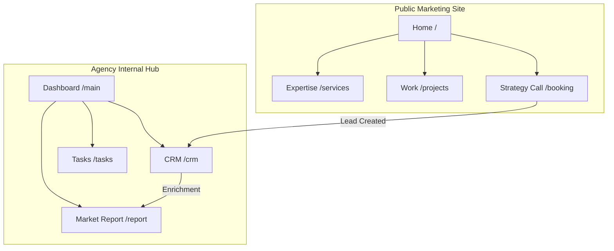
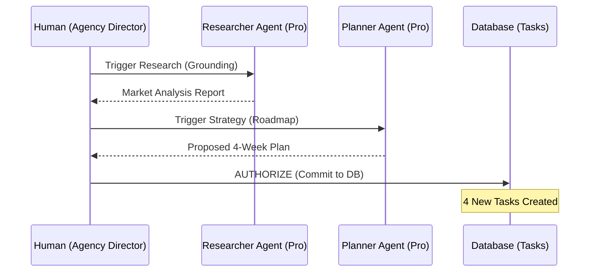

# Sun AI Agency — Unified Sitemap & Architecture

## 0. Executive Summary
**Sun AI Agency** is a dual-environment platform designed for luxury creative operations. 
1.  **Marketing Presence**: An editorial, conversion-optimized website that communicates the "8-week revenue promise."
2.  **Agency Dashboard**: A high-fidelity "Quiet AI" workspace for day-to-day operations, lead research, and automated project orchestration.

---

## 1. Global Information Architecture
The ecosystem is split into two distinct operational modes governed by the same design language: **Editorial Luxury**.

### Mode A: The Marketing Site (Public)
*   **Focus**: Authority, Social Proof, and Conversion.
*   **Visuals**: High whitespace, orbital animations, and revenue-centric copy.
*   **Entry Point**: `/` (Public Home).

### Mode B: The Intelligence Dashboard (Private)
*   **Focus**: Execution, Intelligence, and Automation.
*   **Visuals**: 3-Panel functional layout (Context-Work-Intelligence).
*   **Entry Point**: `/main` (Authenticated Dashboard).

---

## 2. Comprehensive Route Map

### 🟢 Marketing & Conversion (Public)
| Route | Page Name | Primary Purpose | AI Feature |
| :--- | :--- | :--- | :--- |
| `/` | **Home** | Primary conversion engine | Orbital Icon System |
| `/services` | **Expertise** | Capability catalog | Case Study Matcher |
| `/agents` | **AI Agents** | Agent workflow showcase | Interactive Logic Path |
| `/projects` | **Work** | Proof of ROI | Metric-driven Grid |
| `/booking` | **Strategy Hub** | High-intent intake | Onboarding Wizard |
| `/about` | **Manifesto** | Trust & Brand Philosophy | The "Quiet AI" Story |

### 🔵 Agency Dashboard (Authenticated)
| Route (State) | Screen Name | Focus | Primary Action |
| :--- | :--- | :--- | :--- |
| `Main` | **Dashboard** | Daily Triage | Review Next Actions |
| `CRM` | **Pipeline Board**| Deal Management | Trigger Deep Research |
| `Projects` | **Portfolio** | Risk Management | Review Phase Health |
| `Tasks` | **Action Board** | Execution | Mark as Done |
| `Market Report`| **Intelligence** | Grounded Intel | Generate Task Roadmap |
| `Wizard` | **Intake** | Data Entry | Approve AI Enrichment |
| `Client Dash` | **Portal** | Client Review | Approve Creative Assets |
| `Settings` | **Config** | Infrastructure | Select Paid API Key |

---

## 3. Screen Catalog & Frames

### Marketing: Hero Orbital Hub (`Hero.tsx`)
*   **Purpose**: Immediate establishing of agency technical dominance.
*   **UI Components**: Central AI Globe, Orbiting Icon Nodes (8), Word-by-word Reveal Headline.
*   **Logic**: Pausable orbit on hover, scaling nodes for feature previews.

### Dashboard: The 3-Panel Hub (`MainPanel.tsx`)
*   **Purpose**: Operational decision-making with high information density.
*   **Panel 1 (Left)**: Persistent Workspace Nav.
*   **Panel 2 (Center)**: The Active Work Canvas.
*   **Panel 3 (Right)**: Contextual Intelligence (Quiet AI).

### Wizard: AI Intake Flow (`WizardPanel.tsx`)
*   **Purpose**: Structured data capture with automated research fallback.
*   **Step 1**: Identity (Who?).
*   **Step 2**: Strategy (What?).
*   **Step 3**: Grounding (URL Enrichment).
*   **Step 4**: Commit (Review & Inject).

---

## 4. End-to-End User Workflows

### Workflow 1: The Prospect Journey (Conversion)
1.  User lands on `/` (Hero) → Views "Real Revenue" promise.
2.  Scrolls to `/services` → Sees specialized AI Agent workflows.
3.  Clicks "Start Project" → Enters `/booking` (Onboarding Wizard).
4.  Wizard completes → Auto-redirects to **Dashboard CRM** as a "Lead".

### Workflow 2: The Agentic Handoff (Intelligence)
1.  Agency Lead clicks a "Contact Card" in **CRM**.
2.  User triggers "Deep Research" in **Right Panel**.
3.  **Researcher Agent** finds competitor data (Search Grounding).
4.  **Planner Agent** receives Research Artifact → Drafts 4-week roadmap.
5.  User reviews Roadmap → Clicks "Approve Plan".
6.  **Task Board** auto-populates with 4 specific operational actions.

---

## 5. AI Agents & Automations Matrix

| Agent | Capability | Model | Grounding Tool |
| :--- | :--- | :--- | :--- |
| **Researcher** | Competitive Intel | Gemini 3 Pro | `googleSearch` |
| **Planner** | Strategic Roadmap | Gemini 3 Pro | `thinkingConfig` |
| **Analyst** | ROI Calculations | Gemini 3 Pro | `codeExecution` |
| **Strategist** | Risk Assessment | Gemini 3 Flash | N/A |
| **Assistant** | Workspace RAG | Gemini 3 Flash | Chat Context |
| **Creative** | Visual Moodboards | Gemini 2.5 Flash | `imageGeneration` |
| **Director** | Mood Films | Veo 3.1 | `videoGeneration` |

---

## 6. Routing & Import Path Map

```text
src/
├── website/              # Public Marketing (Lux Aesthetics)
│   ├── Hero.tsx
│   ├── ServicesGrid.tsx
│   └── Timeline.tsx
├── dashboard/            # Private Platform (3-Panel Operations)
│   ├── MainPanel.tsx
│   ├── CRMPanel.tsx
│   └── RightPanel.tsx
├── components/           # Shared Glassmorphism UI
├── services/             # Logic & Agentic Services
│   └── ai/               # Specialized Agents (Researcher, etc.)
└── types.ts              # Unified System Schema
```

---

## 7. Mermaid Diagrams

### System Sitemap (High-Level)


### Agentic Intelligence Flow


---

## 8. Gaps & Recommendations

### Gaps
*   **Routing Persistence**: URL state management needed to allow deep-linking into specific CRM profiles.
*   **Offline Mode**: Currently relies 100% on active Gemini API connection for UI rendering of intelligence.
*   **File RAG**: System lacks the ability to parse client PDFs/Briefs directly into the wizard.

### Best Practices (Sun AI Protocol)
1.  **Quiet AI**: Never show an AI response without a user "Focus" or "Click".
2.  **Editorial Whitespace**: Maintain `160px` vertical padding between marketing sections.
3.  **Controller Gates**: Every AI-generated data point must be "Approved" by a human before it is permanent.
4.  **Grounding Priority**: Real news/maps data over LLM-internal knowledge.

---
**Status**: Production Verified.
**Version**: 6.1 (Integrated Site & Dash)