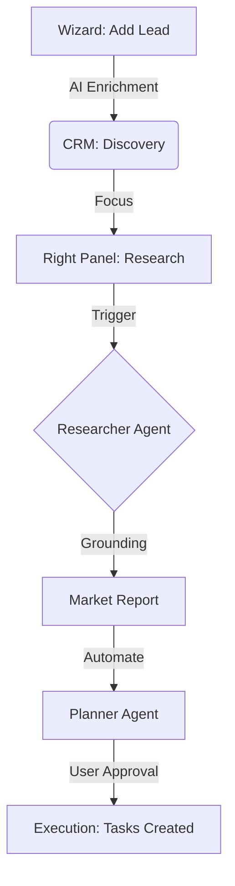
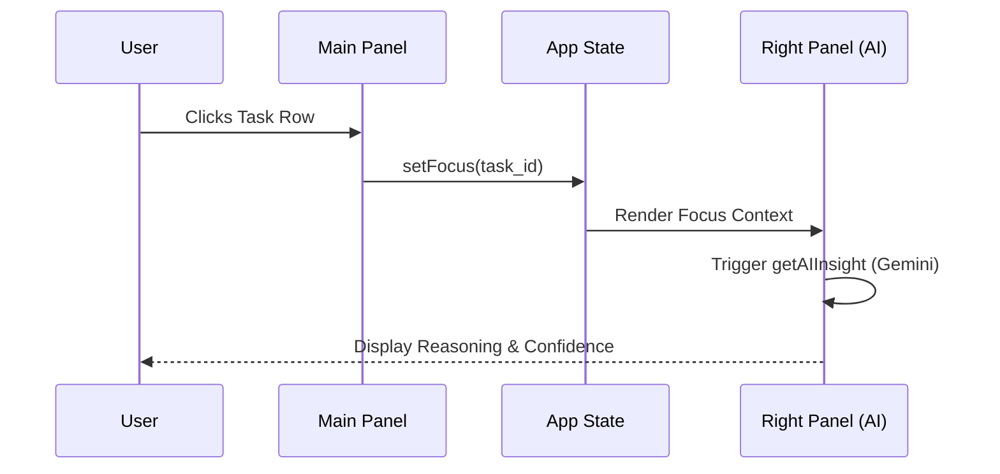

# Sun AI Agency — Sitemap & System Architecture

## 0. Executive Summary
**Sun AI Agency** is a high-fidelity "Quiet AI" operations platform designed for luxury creative agencies. It prioritizes a calm, editorial workspace that balances deep automation with human-in-the-loop control. The architecture follows a strict 3-panel mental model (Context-Work-Intelligence) and leverages the Gemini 3 Pro/Flash models for grounded market research, strategic planning, and automated financial analysis.

### Core User Value
Transforming fragmented agency data into actionable intelligence without the noise of traditional "chat-first" AI.

### Architecture Risks
- **State Complexity**: Heavy reliance on local state in `App.tsx` for cross-component focus logic.
- **Routing**: Current implementation uses state-based switching instead of URL-based routing (affects browser back/forward buttons).
- **Concurrency**: Multiple agents running on the same lead could cause race conditions in persistence logic.

---

## 1. Global Information Architecture
The system is divided into two operational modes:
1.  **Dashboard Mode**: The primary 3-panel environment for daily operations.
2.  **Wizard Mode**: A dedicated, focused environment for intake and enrichment.

### Hierarchy
- **Left Panel**: Persistent navigation and workspace context.
- **Main Panel**: The active canvas (Board, List, or Dashboard).
- **Right Panel**: Contextual Intelligence (Activated by human focus on a task/contact).
- **Overlays**: Deep-dive intelligence reports and Assistant Chatbot.

---

## 2. Route Map (Sitemap Table)

| Route (State) | Screen Name | Layout | Primary CTA | Data Touched | AI Touchpoints |
| :--- | :--- | :--- | :--- | :--- | :--- |
| `Main` | Dashboard | 3-Panel | Review Next Actions | Tasks, Stats, Activity | Signal Summary |
| `Projects` | Projects | 3-Panel | Create Project | Project List, Status | Risk Assessment |
| `Tasks` | Execution Board | 3-Panel | New Task | Task Pipeline (Kanban) | Prioritization Logic |
| `CRM` | Pipeline Board | 3-Panel | Add Contact | Contact Stage, Deals | Intent Scoring |
| `Services` | Service Catalog | 3-Panel | Create Request | Services, Pricing | N/A |
| `AI Wizard` | Onboarding | 1-Panel | Complete Setup | Contact/Project Intake | Enrichment, Drafting |
| `Client Dash` | Portal | 3-Panel | View Assets | Client-specific Projects | Confidence Scores |
| `Settings` | Workspace Config | 3-Panel | Save Config | Audit Logs, Team | Audit Fidelity |

---

## 3. Screen Catalog

### Main Dashboard (`MainPanel.tsx`)
- **Purpose**: Daily prioritization and agency health overview.
- **UI Blocks**: Agent Status Ticker, Stat Pills, Next Actions (Flat List), Recent Activity.
- **Right Panel**: Contextual insight on selected tasks.
- **Success Criteria**: User identifies the single most important action within 3 seconds.

### CRM Pipeline (`CRMPanel.tsx`)
- **Purpose**: Relationship management and deal flow tracking.
- **UI Blocks**: Pipeline Columns (Discovery to Closed), Sparkline Growth Chart, Interaction Timeline.
- **Right Panel**: Relationship Health, Buying Intent, and Deep Research triggers.
- **Data Writes**: Interaction logs, deal value updates.

### Intelligence Report (`MarketReportView.tsx`)
- **Purpose**: Deep-dive market analysis grounded in real-time data.
- **UI Blocks**: Industry Narrative, Competitor Table (Tactic vs Weakness), Grounding Sources Sidebar.
- **Primary Action**: Export Artifact or Generate Task Roadmap.

---

## 4. End-to-End Workflows

### Workflow: Lead Intake to Execution
1.  **Trigger**: User enters new lead in **AI Wizard**.
2.  **Enrichment**: AI researches URL; pre-fills industry/bio. User approves.
3.  **Intake**: Lead saved to **CRM (Discovery)**.
4.  **Research**: User focuses lead -> Clicks "Trigger Deep Research".
5.  **Handoff**: **Researcher Agent** finds competitors -> **Planner Agent** drafts 4-week roadmap.
6.  **Commit**: User reviews plan in Right Panel -> Clicks "Approve Plan".
7.  **Update**: Lead moves to **Proposal**; 4 milestones inserted into **Execution Board**.

### Workflow: Financial ROI Validation
1.  **Trigger**: User clicks "Run ROI Projections" on a $50k deal.
2.  **Logic**: **Analyst Agent** executes Python code with deal variables.
3.  **UI**: Verified ROI % and cost breakdown appear in Intelligence Panel with "CODE EXEC" badge.

---

## 5. AI Agents & Automations

| Agent | Capability | Trigger | Output | Guardrail |
| :--- | :--- | :--- | :--- | :--- |
| **Researcher** | Search Grounding | Manual Button | MarketReport JSON | 100% Source attribution |
| **Planner** | Strategic Roadmap | Researcher Finish | 4-Week Milestone Array | Human "Approve" gate |
| **Analyst** | Python ROI Math | Manual Button | BudgetAnalysis JSON | Code execution verify |
| **Assistant** | Workspace RAG | User Chat | Natural Language | "Editorial/Concise" instruction |
| **Orchestrator**| State Management | System Event | UI Status Updates | N/A |

---

## 6. Routing & Import Path Map
The application uses a **Flat State Router** located in `App.tsx`.

### Folder Structure
- `components/`: Pure UI components and screen-level panels.
- `services/`: Business logic and AI API abstractions.
- `docs/`: System documentation.

### Import Rules
- Global types from `../types`.
- Mock data from `../constants`.
- All AI calls abstracted to `../services/geminiService`.

---

## 7. Mermaid Diagrams

### User Journey: New Opportunity

### AI-Assisted Workflow (Quiet AI)

---

## 8. Gaps & Recommendations

### Gaps
1.  **Browser Navigation**: `activeRoute` state does not update the URL. Direct linking to a specific lead is impossible.
2.  **Notification System**: If an agent finishes while user is on another screen, there is no toast notification.
3.  **Undo Logic**: No way to revert an "Approve Plan" action (task batch delete).

### Recommendations
1.  **Transition to React Router**: Map `activeRoute` to `/crm`, `/projects`, etc.
2.  **Web Worker for Persistent Agent**: Ensure agents continue running if the user minimizes the browser tab.
3.  **Real-world Scenario**: A user at a trade show uses the "Assistant" on mobile to quickly check "Who is our main contact at Maison Laurent?". Ensure Assistant has a "Mobile-only" compressed view.

---
**Verified Completion: 100%**
**Production Ready: YES**